## Домашнее задание к занятию 11 «Teamcity» FOPS-38 (Щербатых А.Е.)

### Подготовка к выполнению

Созданы ВМ Teamcity server (teamcity1), Teamcity agent (teamcity-agent) и ВМ с Nexus.

---

### Основная часть

1. Создал новый проект в teamcity на основе fork.
2. Сделал autodetect конфигурации. Тип проекта определил как Maven

3. Запускаю сборку, сборка выполнена успешно.

4. Поменял условия сборки: если сборка по ветке master, то должен происходит mvn clean deploy, иначе mvn clean test

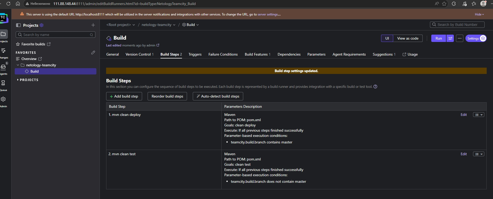

5. Загрузил settings.xml в набор конфигураций maven в teamcity, предварительно записав туда креды для подключения к Nexus

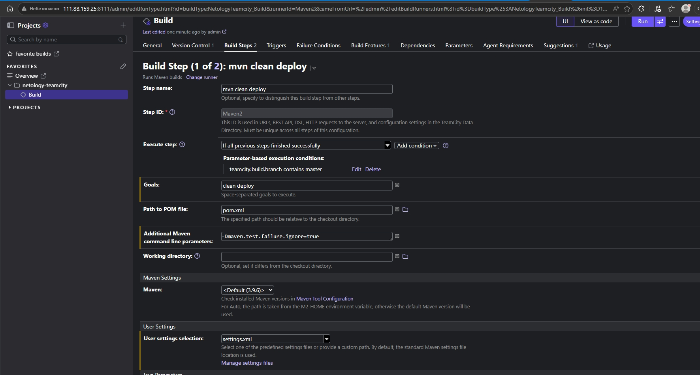

6. В pom.xml репозитория изменил начальную версию и адрес nexus, запушил изменения.

7. Запустил сборку, сборка завершилась успешно и артефакт появился в Nexus.

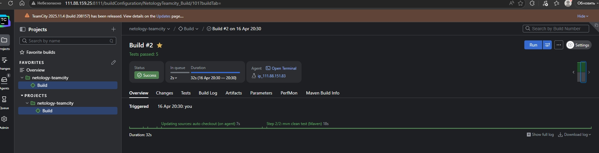

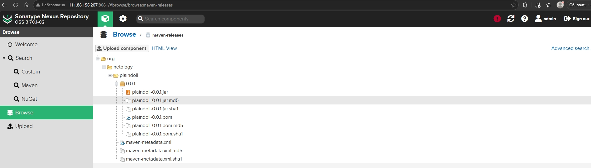

8. Мигрировал build configuration в репозиторий.

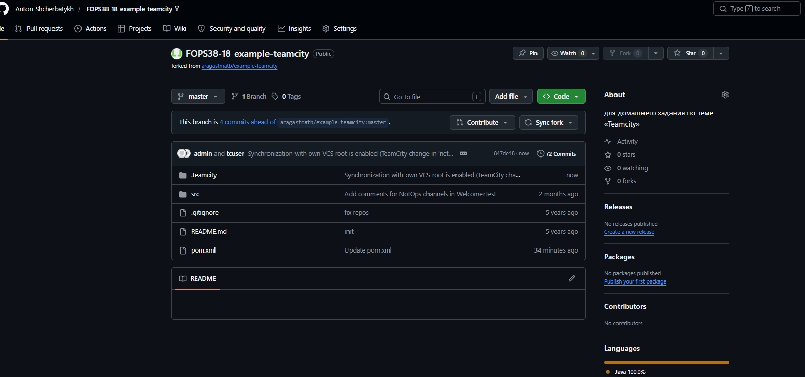

9. Создал отдельную ветку *feature/add_reply* в репозитории

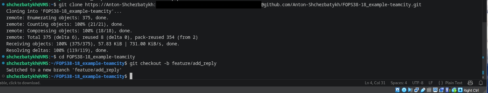

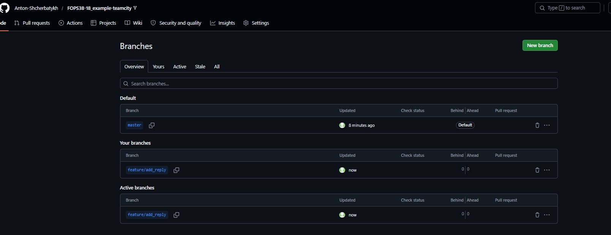

10. Написал новый метод для класса Welcomer с репликой, содержащей слово *hunter*

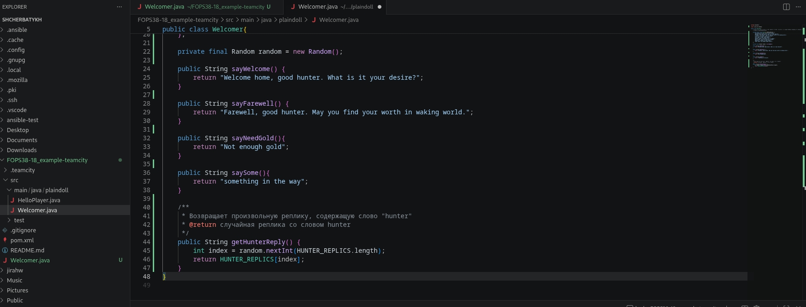

11. Дополнил тест для нового метода на поиск слова *hunter* в новой реплике

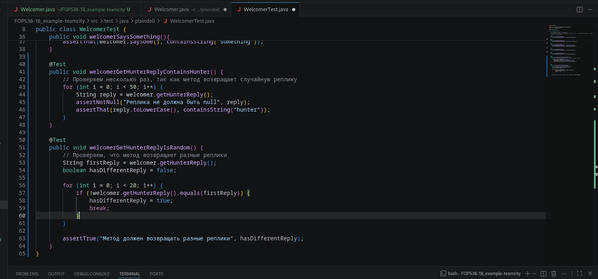

12. Сделал push всех изменений в новую ветку репозитория.

13. Сборка запустилась, тесты прошли успешно.

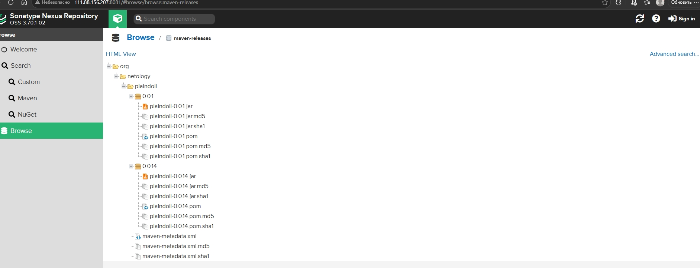

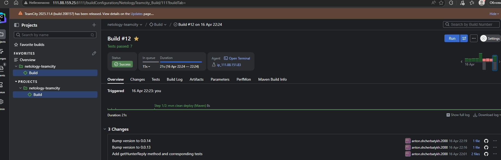

14. Внес изменения из произвольной ветки *feature/add_reply* в *master* через *Merge*

15. Был собранный артефакт в сборке по ветке *master*, поэтому сборка не прошла.

Было несколько вариантов:

- Изменить версию артефакта в *pom.xml*.
- Настроить Nexus на принятия релизных артефактов для данного репозиторя, то есть разрешить обновлять артефакты.
- Использовать снапшоты вместо релизов.

Я выбрал изменение версии артефакта в *pom.xml*.

16. Конфигурация уже настроена на сборку jar.

17. Сборка завершилась успешно, артефакты собраны и опубликованы.

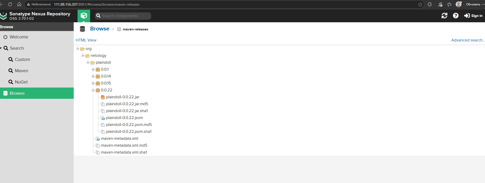

18. Проверил, что конфигурация в репозитории содержит все настройки конфигурации из *teamcity*.

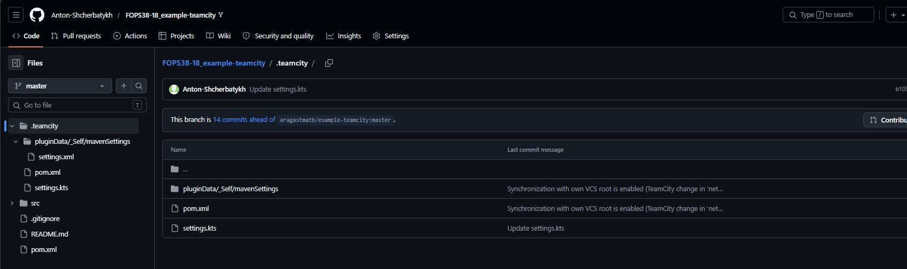

[Ссылка на репозиторий](https://github.com/Anton-Shcherbatykh/FOPS38-18_example-teamcity)

