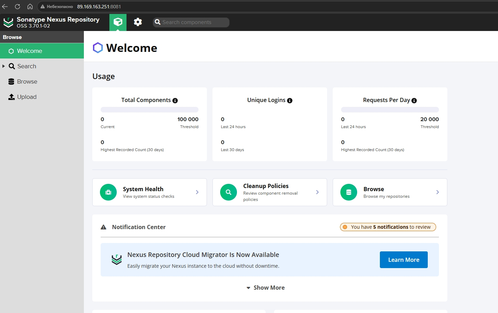
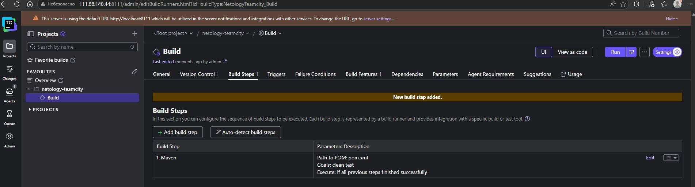
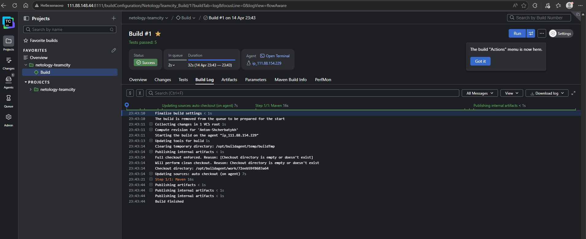
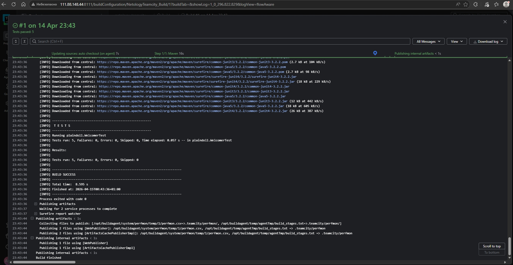

## Домашнее задание к занятию 11 «Teamcity» FOPS-38 (Щербатых А.Е.)

### Подготовка к выполнению

Созданы ВМ Teamcity server (teamcity1), Teamcity agent (teamcity-agent) и ВМ с Nexus.

---

### Основная часть

1. Создал новый проект в teamcity на основе fork.
2. Сделал autodetect конфигурации. Тип проекта определил как Maven

3. Запускаю сборку, сборка выполнена успешно.

4. 

